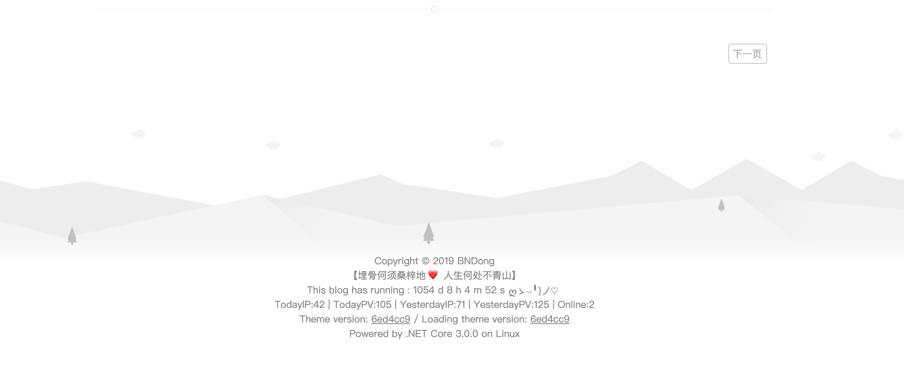

# 配置项

你可以配置在```window.cnblogsConfig```里。

!> Url 类型的配置，请尽量配置支持 Https 的地址！

## 示例

例如我原配置为：

```html
<script type="text/javascript">
    window.cnblogsConfig = {
        GhVersions    : 'v1.2.2',
        blogUser      : "userName",
        blogAvatar    : "https://xxxx.png",
        blogStartDate : "2016-11-17",
    }
<script>
```

我需要新增关于主页图片的配置：```homeTopImg```

新增配置为：

```html
<script type="text/javascript">
    window.cnblogsConfig = {
        GhVersions    : 'v1.2.2',
        blogUser      : "userName",
        blogAvatar    : "https://xxxx.png",
        blogStartDate : "2016-11-17",
        homeTopImg    : [
            "https://x1.jpg",
            "https://x2.jpg",
            "https://x3.jpg",
        ],
    }
<script>
```

?> JavaScript 对象是被命名值的容器。值以名称:值对的方式来书写（名称和值由冒号分隔）。
       

## 主题仓库配置

用于设置样式文件加载源的配置。

### GhUserName - GitHub用户

* 类型：```String```
* 默认值：```BNDong```

GitHub用户名(不是昵称)，注意大小写。

```javascript
window.cnblogsConfig = {
    GhUserName: 'BNDong',
}
```

### GhRepositories - GitHub仓库

* 类型：```String```
* 默认值：```Cnblogs-Theme-SimpleMemory```

GitHub主题仓库名称。

```javascript
window.cnblogsConfig = {
    GhRepositories: 'Cnblogs-Theme-SimpleMemory',
}
```

### GhVersions - 主题版本

* 类型：```String```
* 默认值：```v1.1.2```

GitHub发布版本或提交哈希值，根据版本加载代码。

```javascript
window.cnblogsConfig = {
    GhVersions: 'v1.1.2',
    // or
    GhVersions: 'd2c2e52cfef...38998f0e', // 全哈希值，不要使用七位的部分哈希值
}
```

!> 不推荐使用哈希值加载代码；使用哈希值要明确使用的哈希值所在的大版本中，保证设置的兼容性！

## 基础信息配置

### blogUser - 用户昵称

* 类型：```String```
* 默认值：```[默认抓取博客园用户名]```

用户昵称。

```javascript
window.cnblogsConfig = {
    blogUser: 'BNDong',
}
```

### blogAvatar - 用户头像

* 类型：```Url```
* 默认值：```""```

用户头像图片Url。

```javascript
window.cnblogsConfig = {
    blogAvatar: 'https://pic.cnblogs.com/avatar/1065454/20161119225202.png',
}
```

### blogStartDate - 入园时间

* 类型：```Date```
* 默认值：```2019-01-01```

入园时间，年-月-日，入园时间查看方法：鼠标停留园龄时间上，会显示入园时间。

```javascript
window.cnblogsConfig = {
    blogStartDate: '2019-01-01',
}
```

## 网站配置

### webpageTitleOnblur - 失去焦点标签文字

* 类型：```String```
* 默认值：```(oﾟvﾟ)ノ Hi```

当页面失去焦点，页面title显示的文字。

```javascript
window.cnblogsConfig = {
    webpageTitleOnblur: '(oﾟvﾟ)ノ Hi',
}
```

### webpageTitleOnblurTimeOut - 失去焦点变化延时

* 类型：```Number```
* 默认值：```500```

当页面失去焦点，页面title变化的延时时间，单位毫秒。

```javascript
window.cnblogsConfig = {
    webpageTitleOnblurTimeOut: 500,
}
```

### webpageTitleFocus - 获取焦点标签文字

* 类型：```String```
* 默认值：```(*´∇｀*) 欢迎回来！```

当页面获取焦点，页面title显示的文字；显示后，延时恢复原title。

```javascript
window.cnblogsConfig = {
    webpageTitleFocus: '(*´∇｀*) 欢迎回来！',
}
```

### webpageTitleFocusTimeOut - 获取焦点变化延时

* 类型：```Number```
* 默认值：```1000```

当页面获取焦点，页面title变化的延时时间，单位毫秒。

```javascript
window.cnblogsConfig = {
    webpageTitleFocusTimeOut: 1000,
}
```

### webpageIcon - 网站图标

* 类型：```Url```
* 默认值：```""```

网站图标图片Url。

```javascript
window.cnblogsConfig = {
    webpageIcon: "https://cdn.jsdelivr.net/gh/BNDong/Cnblogs-Theme-SimpleMemory@master/img/webp/blog_logo.webp",
}
```

### switchDayNight - 日/夜间模式

?> 版本 >= v1.2.8

* 类型：```Object```
* 默认值：

```json
{
    enable: true,       // 是否开启日/夜间模式切换按钮
    auto: {             // 自动切换相关配置
        enable: false,  // 开启自动切换
        dayHour: 5,     // 日间模式开始时间，整数型，24小时制
        nightHour: 19   // 夜间模式开始时间，整数型，24小时制
    }
}
```

日/夜间模式配置。

```javascript
window.cnblogsConfig = {
    switchDayNight: {
        enable: true,
        auto: {
            enable: true
        }
    },
}
```

## 字体图标扩展

### fontIconExtend - 字体图标库扩展

* 类型：```Url```
* 相关文档：[字体图标库](https://bndong.github.io/Cnblogs-Theme-SimpleMemory/v1.1/#/Docs/Customization/fonticon)
* 默认值：```""```

字体图标库扩展Css的Url。

```javascript
window.cnblogsConfig = {
    fontIconExtend: "//at.alicdn.com/t/font_xxxxxxxxxx.css",
}
```

## 菜单配置

### menuCustomList - 菜单数据

* 类型：```Object```
* 相关文档：[字体图标库](https://bndong.github.io/Cnblogs-Theme-SimpleMemory/v1.1/#/Docs/Customization/fonticon)
* 默认值：```{}```

自定义菜单数据，显示在默认数据下方。

```javascript
window.cnblogsConfig = {
    menuCustomList: {
        "title1": { // 标题
            "data": [ // 列表数据 ['列表', '链接']
                ['我的博客1', 'https://www.cnblogs.com/bndong/'],
                ['我的博客2', 'https://www.cnblogs.com/bndong/'],
                ['我的博客3', 'https://www.cnblogs.com/bndong/'],
                ['我的博客4', 'https://www.cnblogs.com/bndong/'],
                ['我的博客5', 'https://www.cnblogs.com/bndong/'],
            ],
            "icon": "icon-brush_fill" // 配置图标，参考文档：定制化/字体图标库
        },
        "title2": { // 标题
            "data": [ // 列表数据 ['列表', '链接']
                ['我的博客6', 'https://www.cnblogs.com/bndong/'],
                ['我的博客7', 'https://www.cnblogs.com/bndong/'],
                ['我的博客8', 'https://www.cnblogs.com/bndong/'],
                ['我的博客9', 'https://www.cnblogs.com/bndong/'],
                ['我的博客10', 'https://www.cnblogs.com/bndong/'],
            ],
            "icon": "icon-brush_fill" // 配置图标，参考文档：定制化/字体图标库
        },
    },
}
```

### menuNavList - 菜单导航

?> 版本 >= v1.1.2

* 类型：```Array```
* 默认值：```[]```

自定义菜单导航，显示在默认导航下方。

```javascript
window.cnblogsConfig = {
    menuNavList: [ // 列表数据 ['导航名称', '链接']
        ['我的博客1', 'https://www.cnblogs.com/bndong/'],
        ['我的博客2', 'https://www.cnblogs.com/bndong/'],
    ],
}
```

### menuUserInfoBgImg - 菜单个人信息背景图片

?> 版本 >= v1.1.5

* 类型：```Url```
* 默认值：```""```

菜单个人信息背景图片设置。

```javascript
window.cnblogsConfig = {
    menuUserInfoBgImg: 'https://xxx,jpg',
}
```

## 进度条配置

### progressBar

* 类型：```Object```
* 默认值：

```json
{
    id      : 'top-progress-bar', // 请勿修改该值
    color   : '#77b6ff',
    height  : '2px',
    duration: 0.2,
}
```

进度条配置，显示在页面顶部。

```javascript
window.cnblogsConfig = {
    progressBar: {
         color   : '#77b6ff',
    },
}
```

## Loading配置

### loading

* 类型：```Object```
* 相关文档：[Loading](https://bndong.github.io/Cnblogs-Theme-SimpleMemory/v1.1/#/Docs/Customization/loading)
* 默认值：

```json
{
    rebound: {
        tension: 16,
        friction: 5,
    },
    spinner: {
        id: 'spinner',
        radius: 90,
        sides: 3,
        depth: 4,
        colors: {
            background: '#f0f0f0',
            stroke: '#272633',
            base: null,
            child: '#272633',
        },
        alwaysForward: true, // When false the spring will reverse normally.
        restAt: 0.5,         // A number from 0.1 to 0.9 || null for full rotation
        renderBase: false,
    }
}
```

页面加载loading。

```javascript
window.cnblogsConfig = {
    loading: {
         rebound: {
             tension: 16,
         },
         spinner: {
             id: 'spinner',
             radius: 90,
         }
    },
}
```

## 页面动效配置

### homeTopAnimationRendered - 是否渲染主页banner动效

* 类型：```Boolean```
* 默认值：```true```

是否渲染主页banner动效。

```javascript
window.cnblogsConfig = {
    homeTopAnimationRendered: true,
}
```

### homeTopAnimation - 主页banner动效配置

* 类型：```Object```
* 默认值：

```json
{
    radius: 15,
    density: 0.2,
    color: 'rgba(255,255,255, .2)', // 颜色设置，“random” 为随机颜色
    clearOffset: 0.3,
}
```

主页banner动效配置。

```javascript
window.cnblogsConfig = {
    homeTopAnimation: {
         color   : 'random',
    },
}
```

### essayTopAnimationRendered - 是否渲染文章页banner动效

* 类型：```Boolean```
* 默认值：```true```

是否渲染文章页banner动效。

```javascript
window.cnblogsConfig = {
    essayTopAnimationRendered: true,
}
```

### essayTopAnimation - 文章页banner动效配置

* 类型：```Object```
* 默认值：

```json
{
    triW : 14,
    triH : 20,
    neighbours : ["side", "top", "bottom"],
    speedTrailAppear : .1,
    speedTrailDisappear : .1,
    speedTriOpen : 1,
    trailMaxLength : 30,
    trailIntervalCreation : 100,
    delayBeforeDisappear : 2,
    colorsRandom: false, // v1.2.4 是否开启随机颜色
    colors: [
        '#96EDA6', '#5BC6A9',
        '#38668C', '#374D84',
        '#BED5CB', '#62ADC6',
        '#8EE5DE', '#304E7B'
    ]
}
```

文章页banner动效配置。

```javascript
window.cnblogsConfig = {
    essayTopAnimation: {
        triW : 14,
        triH : 20,
    },
}
```

### bgAnimationRendered - 是否渲染页面背景动效

* 类型：```Boolean```
* 默认值：```true```

是否渲染页面背景动效。

```javascript
window.cnblogsConfig = {
    bgAnimationRendered: true,
}
```

### backgroundAnimation - 页面背景动效配置

* 类型：```Object```
* 默认值：

```json
{
    colorSaturation: "60%",
    colorBrightness: "50%",
    colorAlpha: 0.5,
    colorCycleSpeed: 5,
    verticalPosition: "random",
    horizontalSpeed: 200,
    ribbonCount: 3,
    strokeSize: 0,
    parallaxAmount: -0.2,
    animateSections: true
}
```

页面背景动效配置。

```javascript
window.cnblogsConfig = {
    backgroundAnimation: {
        colorSaturation: "60%",
        colorBrightness: "50%",
    },
}
```

## 主页配置

### homeTopImg - 主页banner图片

* 类型：```Array```
* 默认值：

```json
[
    "https://cdn.jsdelivr.net/gh/BNDong/Cnblogs-Theme-SimpleMemory@master/img/webp/home_top_bg.webp"
]
```

主页banner图片Url，推荐尺寸>= 1920*1080，支持多张，每次刷新随机设置一张。

```javascript
window.cnblogsConfig = {
    homeTopImg: [
        "https://cdn.jsdelivr.net/gh/BNDong/Cnblogs-Theme-SimpleMemory@master/img/webp/home_top_bg.webp",
        "https://cdn.jsdelivr.net/gh/BNDong/Cnblogs-Theme-SimpleMemory@master/img/webp/home_top_bg.webp"
    ],
}
```

### homeBannerText - 主页banner上的标语

* 类型：```String```
* 默认值：```""```

主页banner上的标语，设置此选项会固定显示文字，默认为空，自动获取一句。

```javascript
window.cnblogsConfig = {
    homeBannerText: "好好学习，天天向上！",
}
```

### homeBannerTextType - 标语获取源

?> 版本 >= v1.1.3

* 类型：```String```
* 默认值：```"jinrishici"```

主页 banner 上的标语获取源，默认为 ```jinrishici``` 每次刷新随机获取一句古诗词。

```javascript
window.cnblogsConfig = {
    homeBannerTextType: "one",
}

/** 所有可配置项
jinrishici：每次刷新随机获取一句古诗词。
one：每日获取一句话
*/
```

## 文章页配置

### essayTopImg - 文章页banner图片

* 类型：```Array```
* 默认值：

```json
[
    "https://cdn.jsdelivr.net/gh/BNDong/Cnblogs-Theme-SimpleMemory@master/img/webp/nothome_top_bg.webp"
]
```

文章页banner图片Url，推荐尺寸>= 1920*600，支持多张，每次刷新随机设置一张。

```javascript
window.cnblogsConfig = {
    essayTopImg: [
        "https://cdn.jsdelivr.net/gh/BNDong/Cnblogs-Theme-SimpleMemory@master/img/webp/nothome_top_bg.webp",
        "https://cdn.jsdelivr.net/gh/BNDong/Cnblogs-Theme-SimpleMemory@master/img/webp/nothome_top_bg.webp"
    ],
}
```

### essaySuffix - 文章后缀配置

* 类型：```Object```
* 默认值：

```json
{
    codeImgUrl   : '', // >= v1.1.5 左侧图片设置，不配置使用 window.cnblogsConfig.blogAvatar
    aboutHtml    : '', // 关于博主，不配置使用默认
    copyrightHtml: '', // 版权声明，不配置使用默认
    supportHtml  : '', // 声援博主，不配置使用默认
}
```

文章后缀配置，不配置使用默认。

```javascript
window.cnblogsConfig = {
    essaySuffix: {
        aboutHtml: "I am a good person",
    },
}
```

### reward - 打赏

?> 版本 >= v1.2.7

* 类型：```Object```
* 默认值：

```json
{
    enable: false, // 是否开启打赏功能
    wechatpay: '', // 微信支付二维码图片URL
    alipay: '' // 支付宝支付二维码图片URL
}
```

文章打赏按钮，显示在页面右下角。

```javascript
window.cnblogsConfig = {
    reward: {
        enable: true,
        wechatpay: '//xxxx.png',
    },
}
```

## 代码相关配置

### codeMaxHeight - 限制代码框高度

?> 版本 >= v1.2.5

* 类型：```Boolean```
* 默认值：```"false"```

限制代码框的最大高度；如开启，代码框高度不会超过页面可视区域的70%，隐藏部分通过滚动的方式查看。

```javascript
window.cnblogsConfig = {
    codeMaxHeight: true,
}
```

### 使用博客园默认代码样式

#### essayCodeHighlightingType

* 类型：```String```
* 默认值：```"cnblogs"```

使用博客园代码高亮样式，介意加载速度的可以使用此配置。

```javascript
window.cnblogsConfig = {
    essayCodeHighlightingType: "cnblogs",
}
```

#### essayCodeHighlighting

* 类型：```String```
* 默认值：```""```

当使用博客园代码高亮样式时，此配置不会对渲染产生影响。

### 使用 highlightjs 渲染代码

* 相关文档：[highlight](https://bndong.github.io/Cnblogs-Theme-SimpleMemory/v1.1/#/Docs/Guide/highlight)

#### essayCodeHighlightingType

* 类型：```String```
* 默认值：```"cnblogs"```

使用 ```highlightjs``` 插件渲染代码高亮。

```javascript
window.cnblogsConfig = {
    essayCodeHighlightingType: "highlightjs",
}
```

#### essayCodeHighlighting

* 类型：```String```
* 默认值：```""```

highlightjs 代码高亮主题：[demo](https://highlightjs.org/static/demo/)

```javascript
window.cnblogsConfig = {
    essayCodeHighlighting: "a11y-dark",
}

/** 所有可配置项
default、a11y-dark、a11y-light、agate、an-old-hope、androidstudio、arduino-light、arta、ascetic
、atelier-cave-dark、atelier-cave-light、atelier-dune-dark、atelier-dune-light、atelier-estuary-dark
、atelier-estuary-light、atelier-forest-dark、atelier-forest-light、atelier-heath-dark
、atelier-heath-light、atelier-lakeside-dark、atelier-lakeside-light、atelier-plateau-dark、atelier-plateau-light
、atelier-savanna-dark、atelier-savanna-light、atelier-seaside-dark、atelier-seaside-light
、atelier-sulphurpool-dark、atelier-sulphurpool-light、atom-one-dark-reasonable、atom-one-dark、atom-one-light
、brown-paper、codepen-embed、color-brewer、darcula、dark、darkula、docco、dracula、far
、foundation、github-gist、github、gml、googlecode、grayscale、gruvbox-dark、gruvbox-light、hopscotch
、hybrid、idea、ir-black、isbl-editor-dark、isbl-editor-light、kimbie.dark、kimbie.light、lightfair
、magula、mono-blue、monokai-sublime、monokai、nord、obsidian、ocean、paraiso-dark、paraiso-light、pojoaque
、purebasic、qtcreator_dark、qtcreator_light、railscasts、rainbow、routeros、school-book、shades-of-purple
、solarized-dark、solarized-light、sunburst、tomorrow-night-blue、tomorrow-night-bright
、tomorrow-night-eighties、tomorrow-night、tomorrow、vs、vs2015、xcode、xt256、zenburn
*/
```

### 使用 prettify 渲染代码

#### essayCodeHighlightingType

* 类型：```String```
* 默认值：```"cnblogs"```

使用```prettify```插件渲染代码高亮。

```javascript
window.cnblogsConfig = {
    essayCodeHighlightingType: "prettify",
}
```

#### essayCodeHighlighting

* 类型：```String```
* 默认值：```""```

prettify 代码高亮主题（需梯子访问）：[demo](https://rawgit.com/google/code-prettify/master/styles/index.html)

```javascript
window.cnblogsConfig = {
    essayCodeHighlighting: "obsidian",
}

/** 所有可配置项
prettify、desert、sunburst、obsidian、doxy
*/
```

## 页脚配置

### footerStyle - 页脚样式

?> 版本 >= v1.1.8

* 类型：```Int```
* 默认值：```2```

页脚样式：

footerStyle: 1


footerStyle: 2



```javascript
window.cnblogsConfig = {
    footerStyle: 1,
}
```

### bottomBlogroll - 友情链接

* 类型：```Array```
* 默认值：```[]```

友情链接。

```javascript
window.cnblogsConfig = {
    bottomBlogroll: [ // 友情链接，[[链接名,链接]....]
        ["申请坑位", 'https://msg.cnblogs.com/send/BNDong'],
        ["申请坑位", 'https://msg.cnblogs.com/send/BNDong'],
        ["申请坑位", 'https://msg.cnblogs.com/send/BNDong'],
        ["申请坑位", 'https://msg.cnblogs.com/send/BNDong'],
        ["申请坑位", 'https://msg.cnblogs.com/send/BNDong'],
    ],
}
```

### bottomText - 页脚标语

* 类型：```Object```
* 默认值：

```json
{
    icon: "❤️",
    left : "",
    right: ""
}
```

页脚标语。

?> v1.1.4 版本之前不配置使用默认标语，v1.1.4 版本及以后不配置不会显示。

```javascript
window.cnblogsConfig = {
    bottomText: {
        left : "好好学习",
        right: "天天向上",
    },
}
```

## 控制台输出

### consoleList

* 类型：```Array```
* 默认值：```[]```

控制台输出。

```javascript
window.cnblogsConfig = {
    consoleList: [
         ['BNDong CNBlogs', 'https://www.cnblogs.com/bndong'],
         ['BNDong GitHub', 'https://github.com/BNDong'],
         ['BNDong Email', 'dbuo@foxmail.com'],
    ],
}
```

## 版本映射

### isVersionMapping

?> 版本 >= v1.2.6

* 类型：```Boolean```
* 相关文档：[版本映射](https://bndong.github.io/Cnblogs-Theme-SimpleMemory/v1.1/#/Docs/Guide/versionMapping)
* 默认值：```"false"```

是否开启版本映射，默认关闭。

```javascript
window.cnblogsConfig = {
    isVersionMapping: true,
}
```