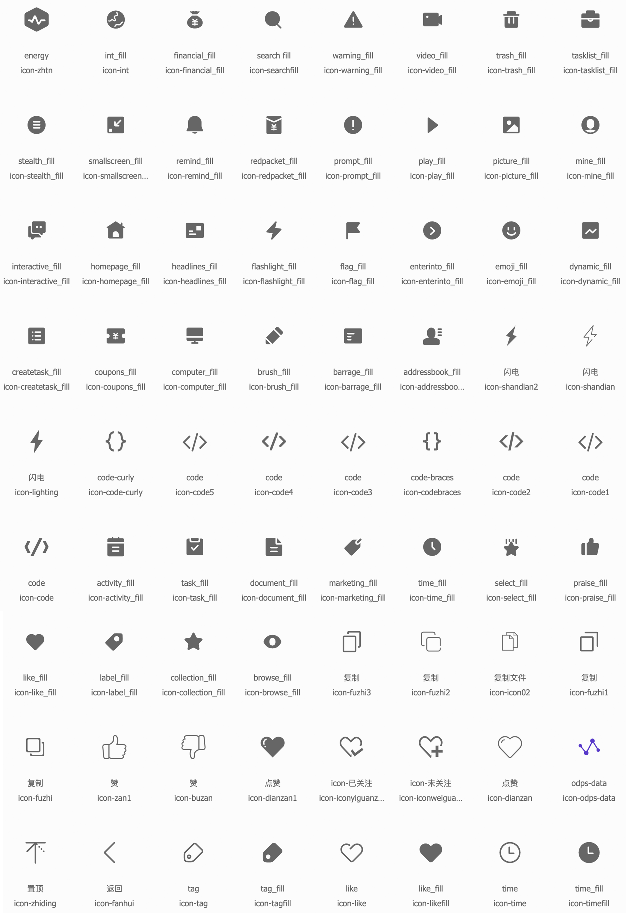

# 字体图标库

本主题使用的图标库为阿里巴巴矢量图标库 [iconfont](https://www.iconfont.cn/)。

> 图标下方第一行为标题，第二行为图标代码（修改图标使用此代码）



## 拓展方法
大家可以在 iconfont 生成自己的图标库，生成方法参考[官方教程](https://www.iconfont.cn/help/detail?spm=a313x.7781069.1998910419.13&helptype=about)。
<br>获取样式地址后添加到配置中.

```javascript
window.cnblogsConfig = {
    fontIconExtend: "//at.alicdn.com/t/font_543384_ezv3l7gd9r7.css",
}
```