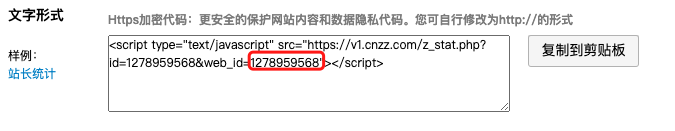
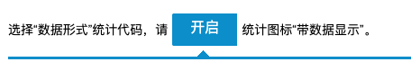

# 网站统计

本主题整合 CNZZ 网站统计，并对样式进行了优化。如果需要本功能，请首先去 CNZZ 配置网站的统计，然后修改下面的代码，添加至页脚 Html 代码中。

```html
<div id="cnzzProtocol"  style="display: none;">
    <span class="id_cnzz_stat_icon" id='cnzz_stat_icon_你的统计ID'></span>
    <script src='https://v1.cnzz.com/z_stat.php?id=你的统计ID&online=1&show=line' type='text/javascript'></script>
</div>
```

## 如何配置 CNZZ

CNZZ 网址：[U-Web](https://web.umeng.com/)

注册/登录你的账户，立即使用并开始配置站点。

### 添加站点


### 获取统计 ID



### 站点设置

开启详细数据。

