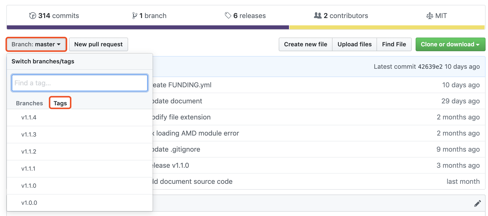
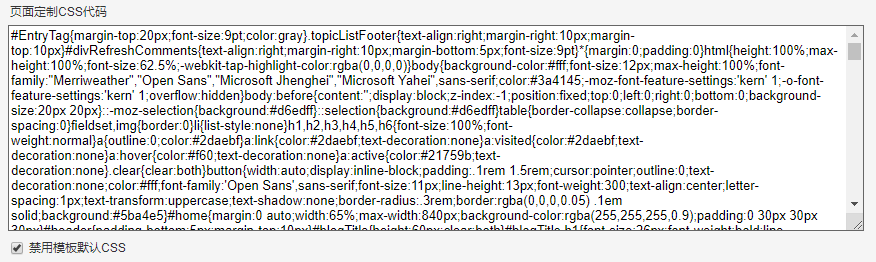
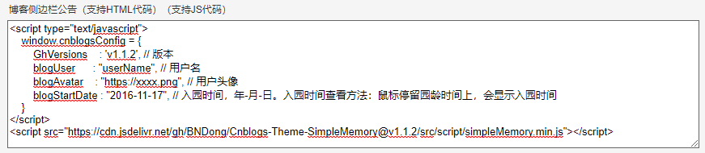

# 安装配置

!> 本主题需要JS权限，没有的请先申请权限。

## 视频介绍

[百度云](https://pan.baidu.com/s/1wDCrM1Uo9iZ6ppBZDU7wKQ)

## 关于博客园后台

进入管理后台：[管理后台](https://i.cnblogs.com/Configure.aspx)

### 设置

设置页面：


本主题当前页面所涉及的配置有：

- 博客皮肤
- 页面定制CSS代码
- 禁用模板默认CSS
- 博客侧边栏公告
- 页脚Html代码

### 选项

选项页面：


本主题当前页面所涉及的配置有：

- 控件显示设置/公告 [#86](https://github.com/BNDong/Cnblogs-Theme-SimpleMemory/issues/86)

## 获取需要使用的版本

进入主题仓库：[GitHub](https://github.com/BNDong/Cnblogs-Theme-SimpleMemory)

切换版本：



## 博客设置

### 设置博客皮肤

博客皮肤：```SimpleMemory```


### 设置页面定制CSS代码

CSS代码位置：```/src/style/base.min.css``` 拷贝此文件代码至页面定制CSS代码文本框处。

!> /src/style/base.min.css 的修改参考 /src/style/base.css。博客设置请使用压缩版本，直接使用 /src/style/base.css 会字符超限！



### 禁用模板默认CSS

选中页面定制CSS代码文本框下面的禁用模板默认CSS。

### 设置博客侧边栏公告

?> 推荐版本 >= v1.1.2，建议使用最新版本：[](https://github.com/BNDong/Cnblogs-Theme-SimpleMemory/releases)

在侧边栏HTML代码中设置以下代码：

```html
<script type="text/javascript">
    window.cnblogsConfig = {
        GhVersions    : 'v1.2.5', // 版本
        blogUser      : "userName", // 用户名
        blogAvatar    : "https://xxxx.png", // 用户头像
        blogStartDate : "2016-11-17", // 入园时间，年-月-日。入园时间查看方法：鼠标停留园龄时间上，会显示入园时间
    }
</script>
<script src="https://cdn.jsdelivr.net/gh/BNDong/Cnblogs-Theme-SimpleMemory@v1.2.5/src/script/simpleMemory.min.js"></script>
```

!> 注意：引入的文件 simpleMemory.min.js 版本需要与配置 window.cnblogsConfig.GhVersions 一致！

详细配置参考相关[文档](https://bndong.github.io/Cnblogs-Theme-SimpleMemory/v1.1/#/Docs/Customization/config)。



### 开启公告控件

博客设置 --> 控件显示设置 --> 勾选公告

配置完成保存即可成功应用博皮！

---

CND jsdelivr 的 URL 详细规则参考[官方网站](https://www.jsdelivr.com/)。