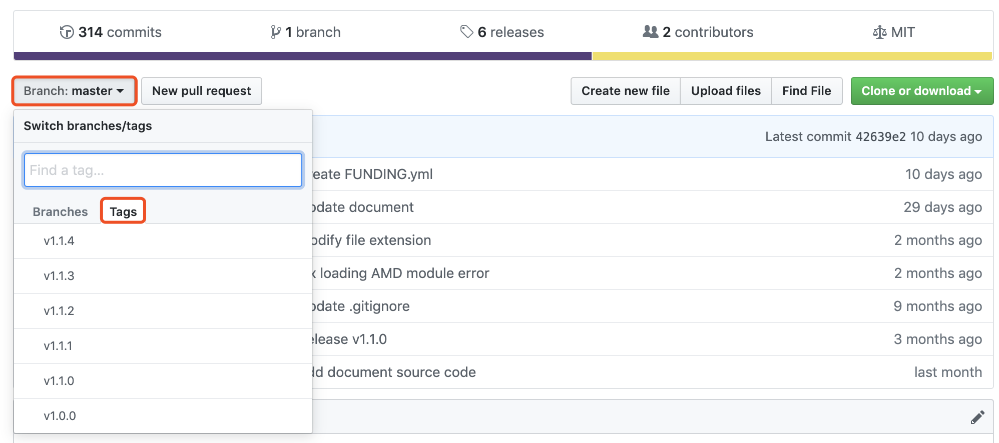

# 版本切换

## v1.0.0 与 v1.1.* 之间切换版本

由于 v1.0.0 与 v1.1.* 版本的配置方式不同，所以建议依据各版本的配置方式重新配置主题。

各版本文档：
- [v1.1.*](http://doc.dbnuo.org/v1.1/)
- [v1.0.*](http://doc.dbnuo.org/v1.0/)

## v1.1.* 之间切换版本

v1.1.* 之间切换版本比较比较简便。

这里我举例 v1.1.2 切换至 v1.1.4:

### 切换代码版本

进入主题仓库：[GitHub](https://github.com/BNDong/Cnblogs-Theme-SimpleMemory)

切换版本：



### 获取版本样式文件

CSS代码位置：```/src/style/base.min.css``` 拷贝此文件代码至页面定制CSS代码文本框处。

### 切换配置版本及引入文件版本

**原配置：**

```html
<script type="text/javascript">
    window.cnblogsConfig = {
        GhVersions    : 'v1.1.2', // 版本
        blogUser      : "userName", // 用户名
        blogAvatar    : "https://xxxx.png", // 用户头像
        blogStartDate : "2016-11-17", // 入园时间，年-月-日。入园时间查看方法：鼠标停留园龄时间上，会显示入园时间
    }
</script>
<script src="https://cdn.jsdelivr.net/gh/BNDong/Cnblogs-Theme-SimpleMemory@v1.1.2/src/script/simpleMemory.min.js"></script>
```

**1) 更改配置版本**

修改配置```window.cnblogsConfig.GhVersions```为```'v1.1.4'```

**2) 更改 simpleMemory.min.js 引入的版本**

```html
<script src="https://cdn.jsdelivr.net/gh/BNDong/Cnblogs-Theme-SimpleMemory@v1.1.2/src/script/simpleMemory.min.js"></script>
```

变为

```html
<script src="https://cdn.jsdelivr.net/gh/BNDong/Cnblogs-Theme-SimpleMemory@v1.1.4/src/script/simpleMemory.min.js"></script>
```

**变更版本后配置：**

```html
<script type="text/javascript">
    window.cnblogsConfig = {
        GhVersions    : 'v1.1.4', // 版本
        blogUser      : "userName", // 用户名
        blogAvatar    : "https://xxxx.png", // 用户头像
        blogStartDate : "2016-11-17", // 入园时间，年-月-日。入园时间查看方法：鼠标停留园龄时间上，会显示入园时间
    }
</script>
<script src="https://cdn.jsdelivr.net/gh/BNDong/Cnblogs-Theme-SimpleMemory@v1.1.4/src/script/simpleMemory.min.js"></script>
```

至此版本切换完毕！