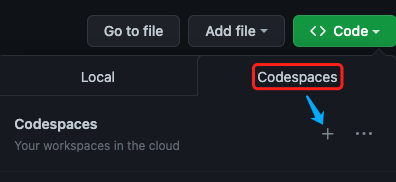
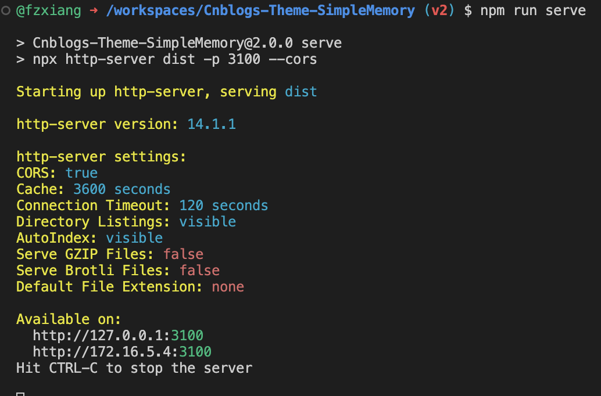
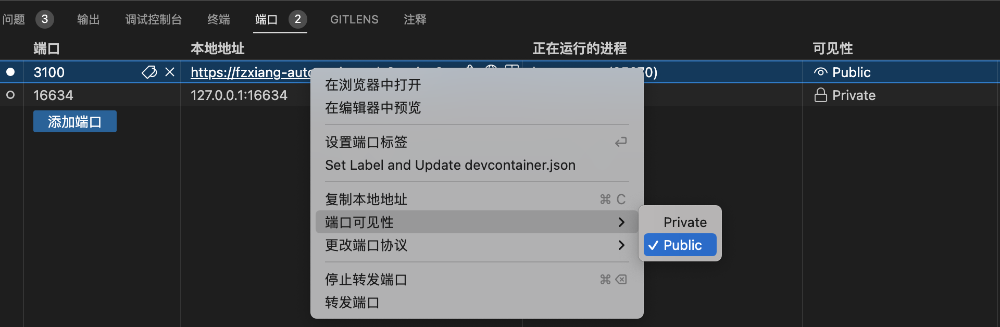
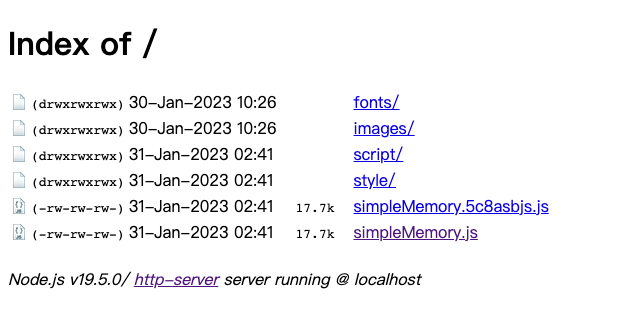
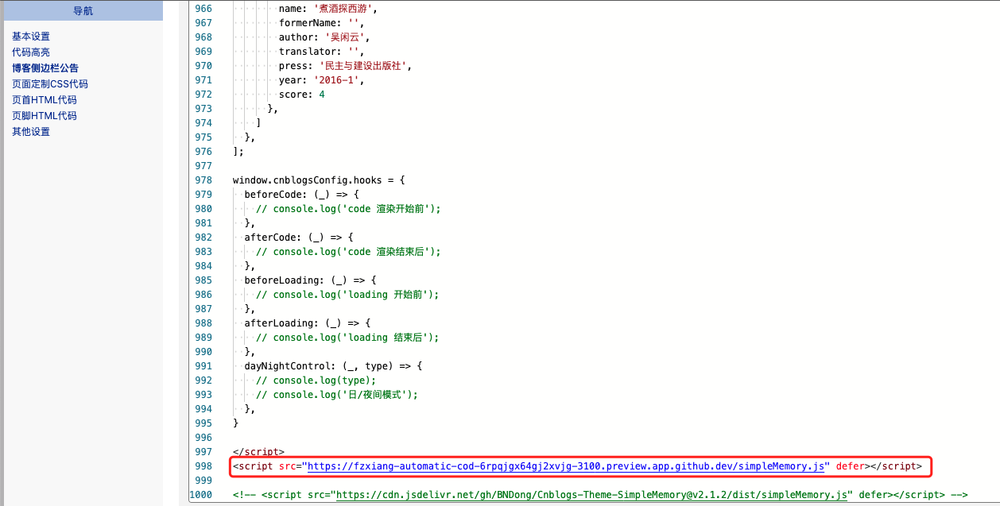

# 使用Codespaces调试开发

?> fork仓库后，如果没有云资源又想要调试代码，这时候可以尝试github推出的codespaces云IDE。

- 在github上创建一个codespaces
  

1. `control + shift + ~`打开终端，执行命令语句 `npm run server`

2. 切换到端口面板, 右键链接地址，更改端口可见性为`public`

3. 打开链接地址，就能看到`dist`为目录的站点

  
4. 最后在csblogs博客设置中，临时将script脚本地址替换

在codespaces编译后，在刷新博客园网站就能看到更改后的内容

?> github codespaces 每个月免费时长为120 core/h，2核数CPU可以使用60h。